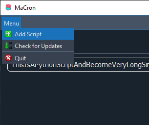

# MaCron
This tool lets you run and Schedule your Python Scripts right from your PC.
 
Check out the Flowchart folder for some more or less useful Flowcharts.
 
 
__This is a Work in Progress.__
 
Status: Prototyping
 
 
Planned Features (so far):
- GUI
- Scheduling of Pythonscripts
  

Limitations:
- Unknown for now

## Previews
Latest Version of the GUI with QT. So far i am happy with it. I also changed the name because i am a comedy genius.
 

 
This is the first test GUI with QT.
 

 
First Iteration of the Main GUI (Mockup made with [draw.io](http://www.draw.io))
 

 
First Iteration of the Add GUI (Edit probably the same just with a different title and the Path already set.)
 

    
Menubar Icons by [Yusuke Kamiyamane.](https://p.yusukekamiyamane.com/)
 
Window Icon (The 2 Macarons) [Macaron stickers created by Gohsantosadrive - Flaticon](https://www.flaticon.com/free-stickers/macaron)</a>

