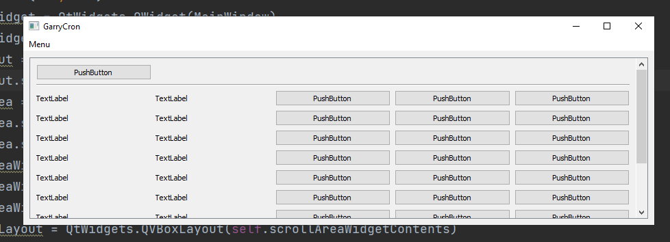

# GarryCron
This tool lets you run and Schedule your Python Scripts right from your PC.
 
 
__This is a Work in Progress.__
 
Status: Planning phase
 
 
Planned Features (so far):
- GUI
- Scheduling of Pythonscripts
  

Limitations:
- Unknown for now

## Previews
This is the first test GUI with QT.
 

 
First Iteration of the Main GUI (Mockup made with [draw.io](http://www.draw.io))
 

 
First Iteration of the Add GUI (Edit probably the same just with a different title and the Path already set.)
 

